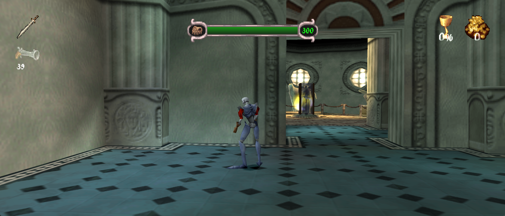
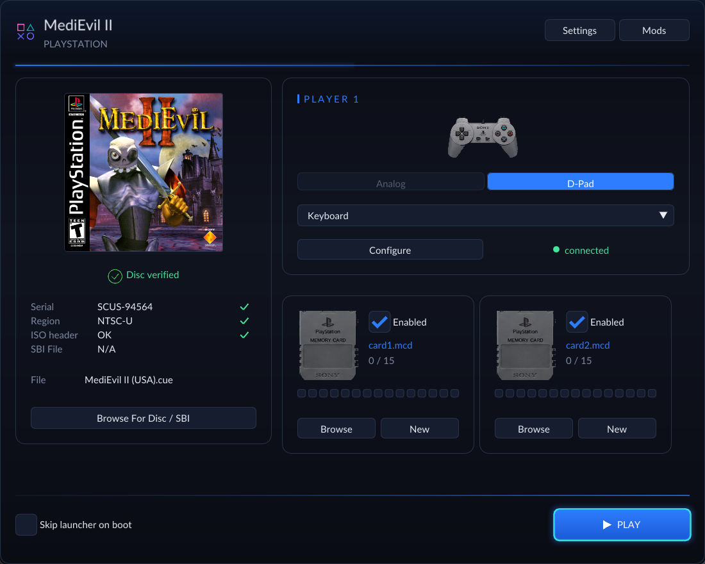
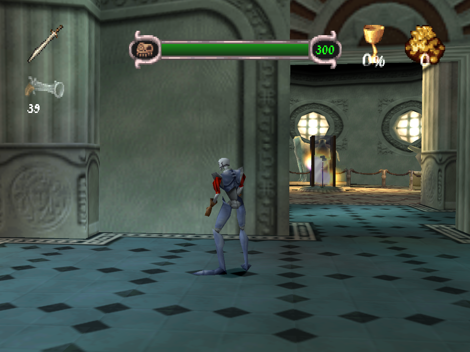
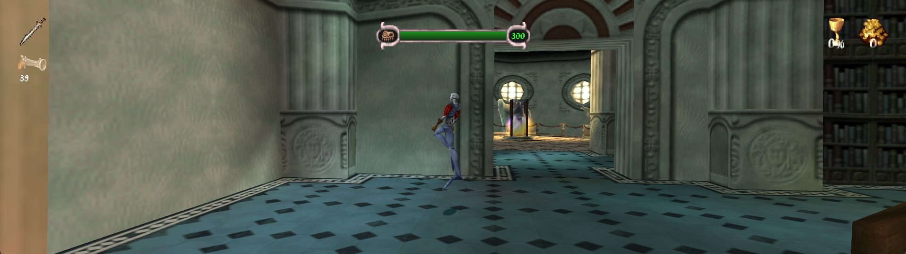
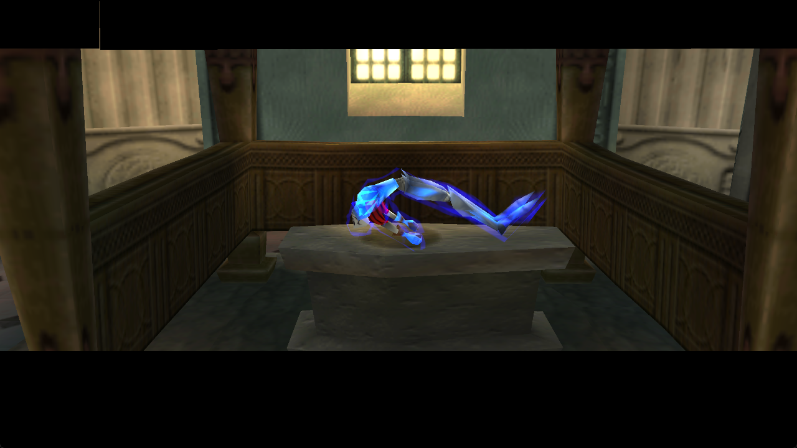

# MediEvil II Recompiled

<!-- retcomm-readme-metrics -->

<!-- /retcomm-readme-metrics -->

A native recompilation of **MediEvil II** for Windows and Linux, built on
[psxrecomp](https://github.com/mstan/psxrecomp) and
[recomp-ui](https://github.com/mstan/recomp-ui). Play with adaptive widescreen,
sharper and steadier graphics, smoother motion, and shorter loading waits.
The gameplay enhancements are **on by default**.

**[Download v0.2.0-alpha](https://github.com/alexbeavs-ps1-ports/medievil-ii-recomp/releases/tag/v0.2.0-alpha)**
contains the merged enhancement series, including HUD anchoring. These are
precompiled player builds: supply your **USA disc (SCUS-94564)** and play.
OpenBIOS is included; no retail BIOS, compiler, Python or Generate step is needed.

*Actual Windows v0.2.0-alpha capture at 21:9, using OpenGL and the default
enhancements. The original game artwork and textures are retained. Screenshots
below come from the same released build; the Museum checkpoint has the weapon
and counter HUD groups visible so their placement can be compared.*

## Download and play

| Platform | Package | Start here |
| --- | --- | --- |
| Windows x64 | [ZIP](https://github.com/alexbeavs-ps1-ports/medievil-ii-recomp/releases/download/v0.2.0-alpha/MediEvilIIRecomp-v0.2.0-alpha-windows-x64.zip) | Extract the whole ZIP into a writable folder and run `MediEvilIIRecomp.exe`. |
| Linux x86-64 | [AppImage](https://github.com/alexbeavs-ps1-ports/medievil-ii-recomp/releases/download/v0.2.0-alpha/MediEvilIIRecomp-v0.2.0-alpha-linux-x86_64.AppImage) | Make it executable, then run it. Requires **glibc 2.39+**, such as Ubuntu 24.04. |

1. Select your MediEvil II USA disc in the launcher: a CUE with its BIN tracks,
   or a supported CHD. The disc remains required while playing.
2. Choose your controller or configure keyboard controls, then press **Play**.
3. The first run prepares the loading cache from your disc. Later runs reuse
   the verified decompressed assets.

On Linux, if FUSE is unavailable, run the AppImage with
`--appimage-extract-and-run`. SHA-256 checksum files are available beside the
packages on the release page. No disc images, decoded assets or saves are included.

*The launcher includes local box art, disc selection, controls, memory cards,
display settings and the Mods manager. Its artwork does not need an internet
connection.*

## Features at a glance

These are the defaults for a fresh install. Existing saved preferences are retained.

| Feature | What it changes | Default |
| --- | --- | --- |
| **Adaptive View** | Fits the world to the window, including ultrawide displays, while preserving proportions. | On; 4:3 minimum |
| **HUD anchoring** | Weapons and ammo follow the left edge; chalice and gold follow the right; health stays centered. | Included in Adaptive View |
| **Extended terrain** | Draws terrain at 3x the original distance and expands visibility for the wider view. | Included in Adaptive View |
| **Terrain subdivision bypass** | Keeps the original terrain faces instead of the game's distance-dependent triangle splitting. | Included in Adaptive View |
| **Cutscene layout** | Extends black bars across the view while keeping subtitles centered and unstretched. | Included in Adaptive View |
| **Higher internal resolution** | Renders sharper geometry at a whole multiple of the original resolution. | 1080p preset |
| **PGXP Precision** | Retains subpixel geometry and perspective-correct textures to reduce wobble and warping. | On, including CPU precision propagation |
| **World Texture Filtering** | Stabilizes fine world texture detail during movement while keeping text and HUD sprites sharp. | On |
| **Smooth Presentation** | Draws intermediate camera and model poses without speeding up gameplay. | On; Display target |
| **Resident Loading** | Preloads supported files and reuses decompressed assets to reduce loading waits. | On |
| **OpenBIOS fast boot** | Uses the included OpenBIOS kernel and skips its startup shell. | On |
| **Precompiled engine and level code** | Runs the audited game and known level-module placements without player-side compilation. | Included |
| **Bezel Artwork** | Places a user-selected image in unused screen margins, when the view leaves any. | Off; optional decoration |

### Adaptive widescreen, terrain and HUD

Resize the window and the world view follows it. Wider screens reveal more
of the environment horizontally; characters and scenery keep their proportions.
The minimum view is 4:3, with no fixed maximum aspect ratio.

The view enhancement also expands terrain visibility and draw distance to
**3x**, adjusts culling for the wider view, and bypasses the original terrain
subdivision. Subdivision was the game's way of breaking surfaces into smaller
triangles; the enhanced renderer combines the original faces with perspective
correction instead. Expanded render buffers and 8 MB of emulated main RAM are
enabled automatically for this path. These work together under **Adaptive
View**, with no separate distance or subdivision controls to configure.

HUD icons and their numbers move together: weapon/ammo groups stay at the
left, chalice/gold at the right, and health in the center. Their original size,
proportions and fade timing are preserved. The following captures show the
same Museum checkpoint at different window shapes; click an image for its
original resolution.

**4:3**

**32:9**

*Both captures use the enhanced renderer. This compares aspect ratios, not
original PlayStation graphics against enhanced graphics. Dan's idle animation
can differ between captures.*

### Sharper geometry and stable textures

The **1080p internal-resolution preset** rounds up to a whole native-resolution
multiplier. For 240-line content, that is **5x, or 1200 rendered lines**, scaled
to the window. This makes geometry sharper while retaining the game's original
texture artwork. Internal resolution can be changed in the display settings.

**PGXP Precision** keeps extra precision as vertices move through the game's
math, then uses it for steadier geometry and perspective-correct texture mapping.
CPU propagation is enabled too, so supported vertex calculations retain that
precision. PGXP remains part of this release; the game has not been rewritten
entirely in floating-point math.

**World Texture Filtering** complements PGXP by stabilizing fine texture patterns
when they shrink on screen. Its OpenGL path uses palette-aware filtering for
identified 3D surfaces, while text, HUD elements and other 2D sprites retain
sharp sampling. It is one default-on behavior with an on/off switch in Mods.
The shared renderer also fixes the Museum doorway's camera-dependent diagonal
texture breaks. These changes have been checked during movement and camera
settling, rather than only in still images.

### Cutscenes and movies

In-engine cutscene bars span the whole adaptive view, including during
interpolated drawing and the Museum intro's flashes. **Subtitles retain their
original proportions and centered placement**; widening the bars does not
stretch the lettering. Prerecorded movies keep their authored proportions,
and the movie/background flicker fix is included.

*In-engine Museum intro at 16:9. Circular fade coverage and other special
transition effects still need broader playtesting; this release does not claim
that every fade is corrected at every aspect ratio.*

### Smooth Presentation and frame-rate targets

The default **Display** setting follows the current monitor's refresh rate.
**60, 120, 144, 240 and 360** are also available in Mods under Smooth Presentation.
The OpenGL renderer interpolates camera/model transforms and draws additional
poses between the game's normal frames. Gameplay, input, timers and audio keep
their original timing.

A selected rate is a **target**, not a measured FPS or a guarantee that every
refresh contains a new rendered frame. In the measured Museum tests with all
visual defaults enabled, game timing stayed near its original 59.94 Hz VBlank
cadence and native drawing near 30 Hz. The renderer produced additional
intermediate draws, but did not sustain the highest presentation targets.
That testing used a Ryzen 7 9800X3D and RTX 3080 Ti at 5x internal resolution;
performance varies with hardware, scene and window size. The renderer skips
terrain outside the view to reduce redraw cost without reducing the extended
distance or visual defaults.

### Resident Loading

**Resident Loading** removes supported file-read and decompression waits using
data prepared from your own disc. On first use it verifies and decodes the
archive's **66 PP20-compressed containers**; it also preloads the archive and
**24 level files**, which are already uncompressed. Later runs reuse the verified
cache. The resident data uses about **44.5 MiB of host memory**.

The game still owns asset allocation, relocation, initialization and GPU/audio
uploads. Movies and streamed audio keep their normal timing. Authored fades
and cutscenes remain, so this minimizes loading rather than eliminating every
transition. In one controlled New Game comparison, the measured loading window
before the Museum intro fell from **8.30 seconds to 1.38 seconds**. That is one
observed transition, not a full-game or repeated benchmark.

Changed or unsupported assets fall back to the original loader. You can also
turn Resident Loading off in Mods. It is the game's single loading enhancement;
the generic CD Speed and Fast Loading packages are not needed or included.

### OpenBIOS and ready-to-play packages

The packages bundle **OpenBIOS** and skip its startup shell. The original BIOS
kernel interfaces remain in use; Resident Loading replaces guarded game asset
services without enabling BIOS-call HLE. No retail BIOS dump is required.

The executable includes the audited native engine and known relocated level
code: the release profile covers **24 images and 74,378 compiled variants**.
Unrecognized placements retain a runtime fallback. This removes the need to
compile game code at first launch; it does not claim every possible level
placement has been validated. The disc and first-run asset preparation are
still required.

## Alpha status and saves

This is **v0.2.0-alpha**, with Museum/intro testing and sampled level checks,
not a completed full-game playthrough. HUD placement and moving scenes have
been checked at 4:3, 16:9, 21:9 and 32:9. Later-level special HUDs, circular
fades and other transitions need further coverage. Linux package testing so
far is under WSL; native Linux and Steam Deck hardware remain unqualified.
Smooth Presentation and the stable world filtering path use OpenGL, the default
renderer.

On Windows, settings and saves live beside the executable, so keep the extracted
folder writable and preserve those files when upgrading. On Linux, they live
under `$XDG_DATA_HOME/MediEvilIIRecomp`, or `~/.local/share/MediEvilIIRecomp` by
default; `MEDIEVIL_II_RECOMP_DATA_DIR` overrides it. AppImage upgrades preserve
settings, memory cards and installed mods. The loading cache lives separately
in the system user cache directory.

For a bug report, include the release version, level/location, aspect ratio,
renderer and steps to reproduce it. A short video is especially useful for
motion or flicker issues. Do not attach disc images or extracted game assets.

## Development and evidence

Implementation details, measurements and reproducible checks:

- [Enhancement validation](docs/ENHANCEMENTS.md): renderer, PGXP, terrain, HUD,
  interpolation and performance evidence.
- [Resident Loading validation](docs/RESIDENT_LOADING.md): cache coverage,
  decoder comparisons, loading measurements and fallback behavior.
- [Release builds](docs/RELEASE_BUILDS.md): native-code preparation, Windows ZIP
  and Linux AppImage packaging, following the Tomba release layout.
- [Release notes](RELEASE_NOTES.md) and [included PRs](packaging/included-prs.json).

A development build requires the supported disc, recursive submodules, Python
and a native C/C++ toolchain. Follow the release-build instructions for the
precompiled player profile. Generated game C, extracted modules and owned disc
images are local inputs and are never committed. The submodule gitlinks and
`project-manifest.toml` record the framework pins; package
`RELEASE_MANIFEST.json` records the source revision, pins and payload hashes.

Symbols are maintained in `symbols.toml`; `python3 tools/sync_symbols.py`
updates `psx_symbols.h`. See `psxrecomp/docs/SYMBOLS.md` in a recursive checkout.

<!-- retcomm-readme-launcher -->
## RetComM Launcher

The release packages run standalone with their built-in recomp-ui launcher.
[RetComM Launcher](https://github.com/TechnicallyComputers/RetComM-Launcher)
is also available for managing recomp installations, updates and source builds
in one place. See its [downloads](https://github.com/TechnicallyComputers/RetComM-Launcher/releases)
and [feature guide](https://github.com/TechnicallyComputers/RetComM-Launcher#readme).
<!-- /retcomm-readme-launcher -->

## Game and credits

| | |
| --- | --- |
| Players | 1 |
| Supported release | USA, SCUS-94564 |
| Original publisher | Sony |
| Original release year | 2000 |

You must supply your own original game. Disc images and player data are not
redistributed. OpenBIOS is included with its license notice. See
[third-party notices](THIRD_PARTY_NOTICES.md) for source and dependency licenses;
these do not relicense the game's artwork, names or trademarks.

The launcher uses the USA front cover from
[libretro-thumbnails](https://github.com/libretro-thumbnails/Sony_-_PlayStation).
See [box art attribution](launcher_assets/img/BOXART_SOURCE.txt). The app icon
uses the framework's RetComM controller mark. Gameplay screenshots show the
original game artwork rendered by this port.

## About this project

These ports are developed by a hobbyist (a DevSecOps engineer, not a game
programmer) with substantial AI assistance. Validation includes boot checks,
comparison against emulator behavior, deterministic replay checks and recorded
findings. Bug reports are welcome; the alpha status and tested scope are stated
above so players can distinguish verified improvements from remaining work.

<!-- retcomm-readme-raid -->
---

  <b>R.A.I.D. - Retro AI Development</b> ? a Discord for AI-assisted retro reverse-engineering, decomp &amp; recomp

  

<!-- /retcomm-readme-raid -->
